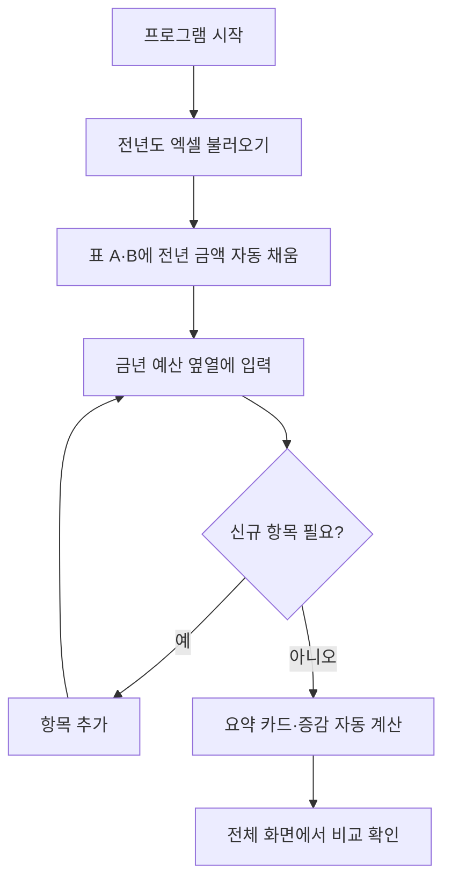

# 전년·금년 예산 비교 프로그램

## 1. 요지

전년도 예산 편성 내역과 금년도 예산 편성 내역을 **한 화면에서 비교**하는 프로그램이다.

---

## 2. 구현 방법

| 구분 | 내용 |
|------|------|
| 데이터 불러오기 | 전년도 예산 편성 내역을 **엑셀(.xlsx)** 로 불러온다 |
| 비교 입력 | 불러온 전년도 내역 **옆 열**에 금년도 예산을 입력해 상호 비교한다 |
| 항목 추가 | 금년도에 **신규 예산이 편성**되면 항목을 추가할 수 있다 |

### 예산 구분

- **비용** (Cost)
- **자본** (Capital)
- **수익** (Revenue)

---

## 3. 화면 표출 규칙

1. **전체 화면**에서 전년·금년 비교 **요약 표**를 표출한다.
2. 예산은 비용 / 자본 / 수익으로 구분한다.
3. **비용 + 자본** → **한 표**에 함께 표시한다.
4. **수익** → **별도 표**로 표시한다.

---

## 4. 화면 전체 레이아웃

### 4.1 메인 화면 (와이어프레임)

```
┌──────────────────────────────────────────────────────────────────────────────┐
│  전년·금년 예산 비교                                          [엑셀 불러오기] │
│  기준연도: 2025(전년)  ↔  2026(금년)                         [항목 추가]    │
├──────────────────────────────────────────────────────────────────────────────┤
│                                                                              │
│  ■ 요약 카드                                                                  │
│  ┌─────────────┐  ┌─────────────┐  ┌─────────────┐  ┌─────────────┐         │
│  │ 전년 합계    │  │ 금년 합계    │  │ 증감액      │  │ 증감률      │         │
│  │  (전체)     │  │  (전체)     │  │             │  │             │         │
│  └─────────────┘  └─────────────┘  └─────────────┘  └─────────────┘         │
│                                                                              │
├──────────────────────────────────────────────────────────────────────────────┤
│                                                                              │
│  ■ 표 A — 비용 · 자본 비교                                                    │
│  ┌────┬──────────┬────────┬──────────┬──────────┬────────┬────────┐         │
│  │구분│ 항목명    │ 전년    │ 금년(입력)│ 증감액    │ 증감률  │ 비고   │         │
│  ├────┼──────────┼────────┼──────────┼──────────┼────────┼────────┤         │
│  │비용│ 인건비    │ 100,000│ 110,000  │ +10,000  │ +10%   │        │         │
│  │비용│ 운영비    │  50,000│  48,000  │  -2,000  │  -4%   │        │         │
│  │자본│ 설비투자  │ 200,000│ 220,000  │ +20,000  │ +10%   │        │         │
│  │자본│ (신규) …  │      — │  30,000  │ +30,000  │   —    │ 신규   │         │
│  ├────┴──────────┼────────┼──────────┼──────────┼────────┼────────┤         │
│  │ 소계 (비용)   │ …      │ …        │ …        │ …      │        │         │
│  │ 소계 (자본)   │ …      │ …        │ …        │ …      │        │         │
│  │ 합계          │ …      │ …        │ …        │ …      │        │         │
│  └───────────────┴────────┴──────────┴──────────┴────────┴────────┘         │
│                                                                              │
├──────────────────────────────────────────────────────────────────────────────┤
│                                                                              │
│  ■ 표 B — 수익 비교                                                           │
│  ┌──────────┬────────┬──────────┬──────────┬────────┬────────┐              │
│  │ 항목명    │ 전년    │ 금년(입력)│ 증감액    │ 증감률  │ 비고   │              │
│  ├──────────┼────────┼──────────┼──────────┼────────┼────────┤              │
│  │ 사업수익  │ 300,000│ 320,000  │ +20,000  │  +6.7% │        │              │
│  │ 기타수익  │  20,000│  25,000  │  +5,000  │ +25%   │        │              │
│  ├──────────┼────────┼──────────┼──────────┼────────┼────────┤              │
│  │ 합계      │ …      │ …        │ …        │ …      │        │              │
│  └──────────┴────────┴──────────┴──────────┴────────┴────────┘              │
│                                                                              │
└──────────────────────────────────────────────────────────────────────────────┘
```

### 4.2 레이아웃 구조 (블록)

```
┌─────────────────────────────────────┐
│           헤더 / 툴바                │
│  제목 · 연도 · 엑셀불러오기 · 항목추가 │
├─────────────────────────────────────┤
│           요약 영역                  │
│     전년합계 | 금년합계 | 증감 | 증감률 │
├─────────────────────────────────────┤
│     표 A: 비용 + 자본 (동일 표)       │
│     · 구분 열로 비용/자본 구분        │
│     · 금년 열은 직접 입력             │
├─────────────────────────────────────┤
│     표 B: 수익 (별도 표)              │
│     · 금년 열은 직접 입력             │
└─────────────────────────────────────┘
```

### 4.3 화면 흐름



---

## 5. 컬럼 정의 (공통)

| 컬럼 | 설명 | 편집 |
|------|------|------|
| 구분 | 비용 / 자본 (표 A만) | 항목 추가 시 선택 |
| 항목명 | 예산 항목 이름 | 신규 항목만 편집 |
| 전년 | 엑셀에서 불러온 전년 편성액 | 읽기 전용 |
| 금년 | 금년 편성액 | **입력** |
| 증감액 | 금년 − 전년 | 자동 계산 |
| 증감률 | (증감액 ÷ 전년) × 100 | 자동 계산 (전년 0이면 —) |
| 비고 | 신규 / 비고 메모 | 선택 입력 |

---

## 6. 주요 기능 요약

1. **엑셀 불러오기** — 전년도 예산 편성 내역 로드 → 표에 반영  
2. **금년 입력** — 전년 옆 열에 금년 금액 입력  
3. **항목 추가** — 신규 예산 항목 추가 (구분: 비용/자본/수익)  
4. **비교 요약** — 상단 요약 + 표별 소계/합계 + 증감 자동 표시  
5. **엑셀 내려받기** — 화면의 비교 결과를 `.xlsx`로 저장 (요약 / 비용·자본 / 수익 시트)

---

## 7. 엑셀 내려받기

| 항목 | 내용 |
|------|------|
| 동작 | [엑셀 내려받기] 클릭 → `예산비교_전년-금년.xlsx` 저장 |
| 시트 | `요약`, `비용`, `자본`, `수익` (비용·자본 분리, 사업명·비고 컬럼 구분) |
| 포함 | 항목별 전년·금년·증감액·증감률 + 소계/합계 |

---

## 8. 실행 방법

1. `index.html` 을 브라우저에서 연다.  
2. 샘플 데이터로 바로 비교·수정·엑셀 내려받기 가능.  
3. 엑셀 불러오기 (`27년도 예산요구안.xlsx` 기준):  
   - 시트: `비용예산…` / `자본예산…` / `수익예산…` ( `27년 사업명` 무시 )  
   - 항목: **세부활동**  
   - 비용 전년: **26년 실행예산**  
   - 자본·수익 전년: **2026 편성액**  
   - 금년: **27년 예산요구안** (비어 있으면 0, 화면에서 입력)  
   - 화면/내려받기: 비용·자본의 **사업명**과 **비고**를 분리, 엑셀 시트도 `비용` / `자본` / `수익` 각각 저장

---

*문서 버전: 0.2 · 작성일: 2026-08-26*
